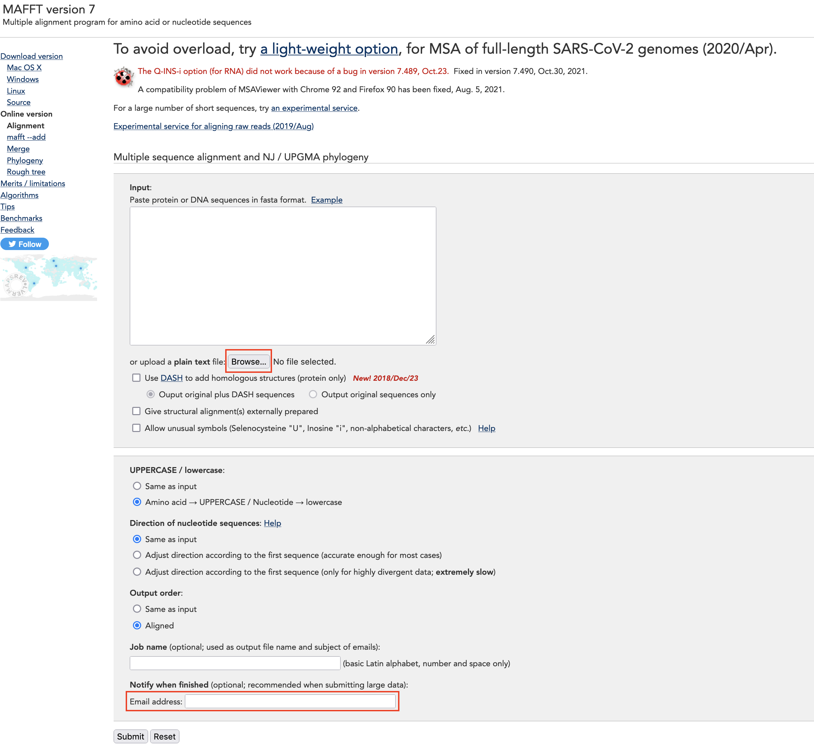
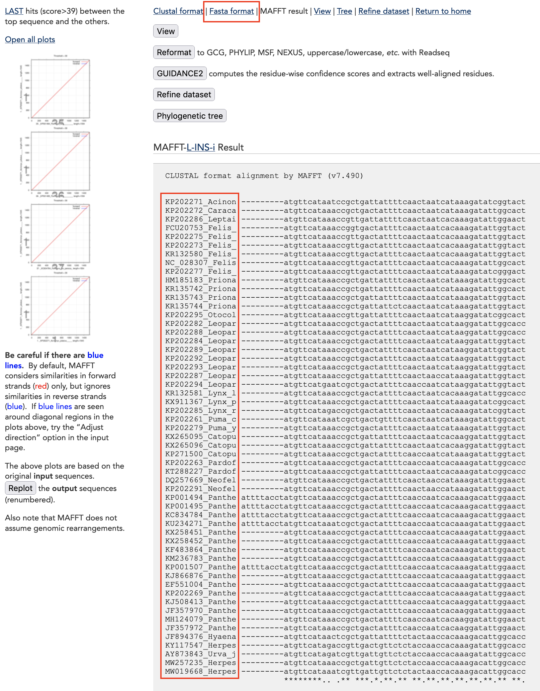
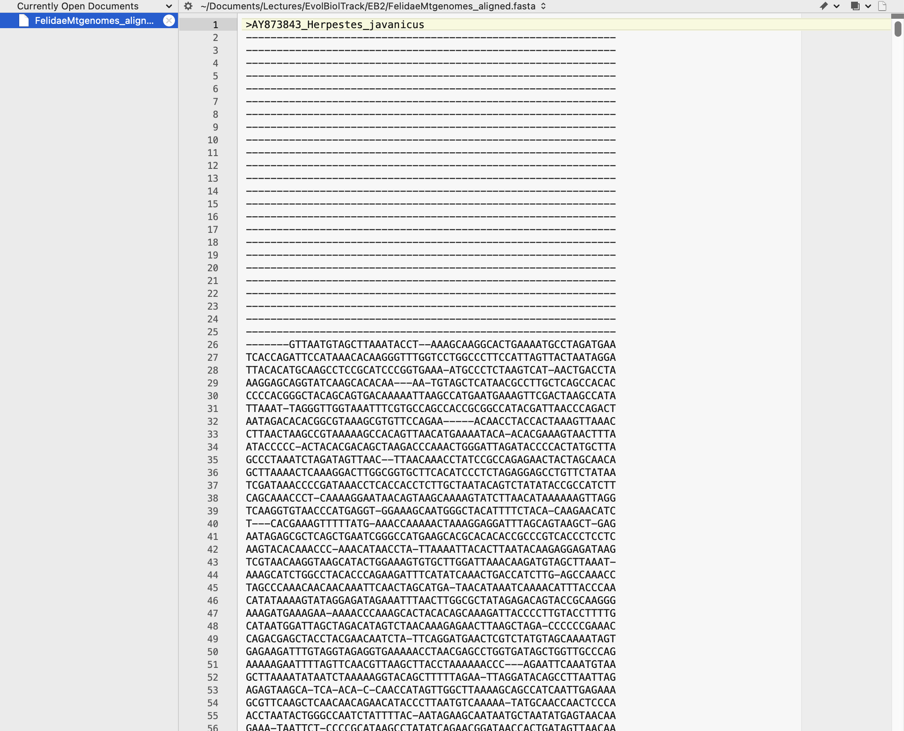
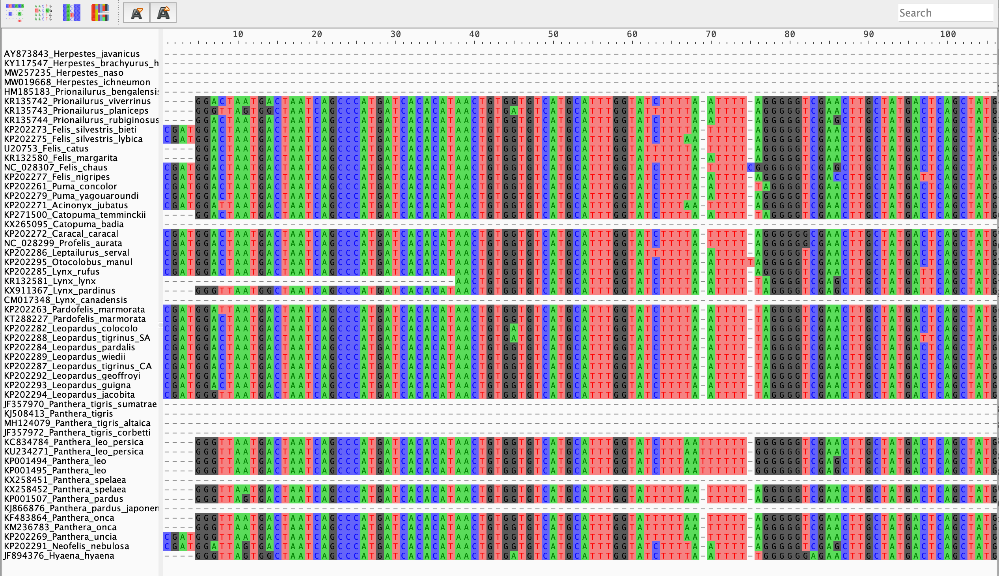
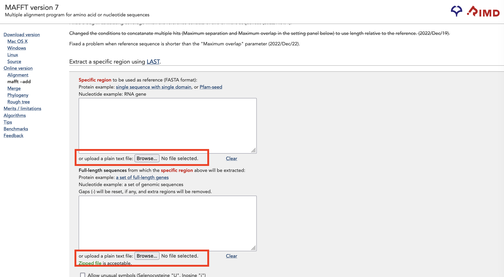
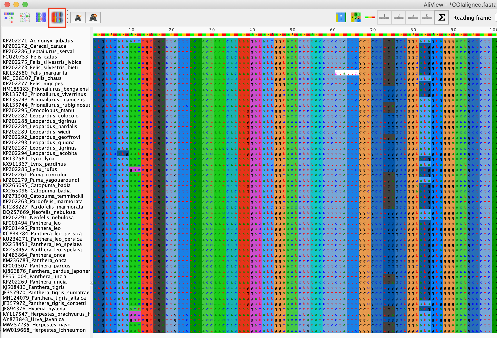
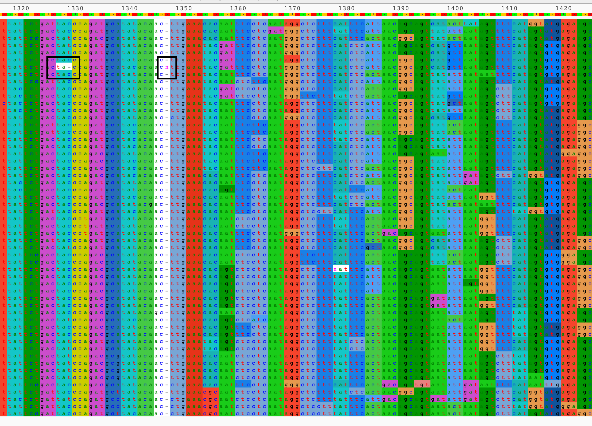
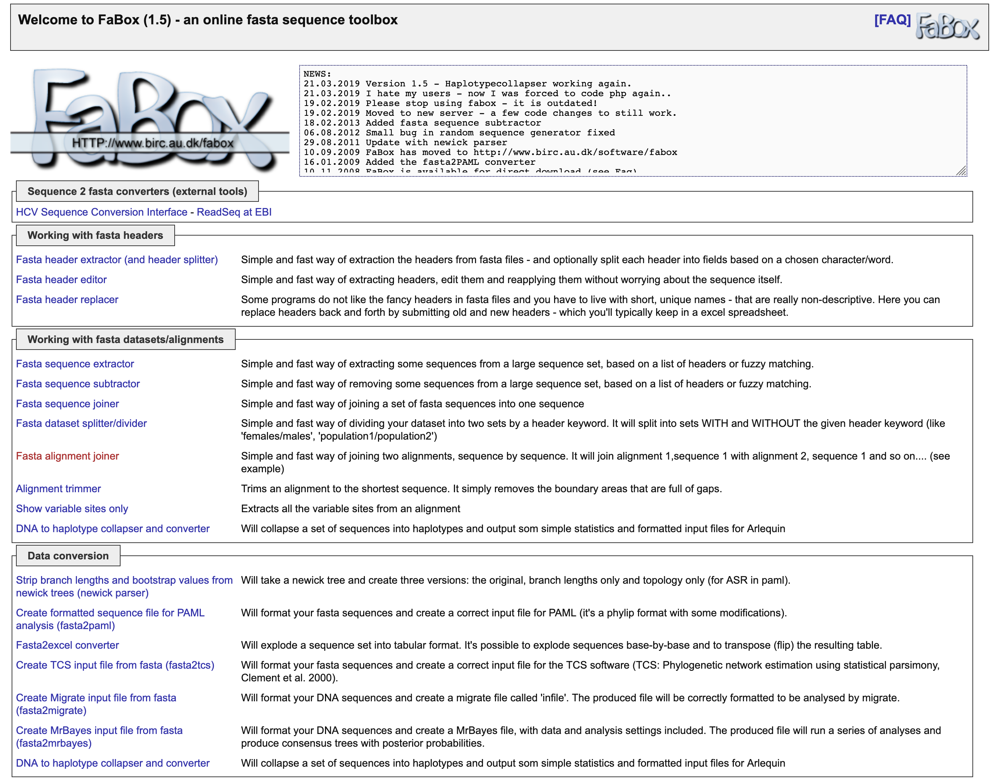
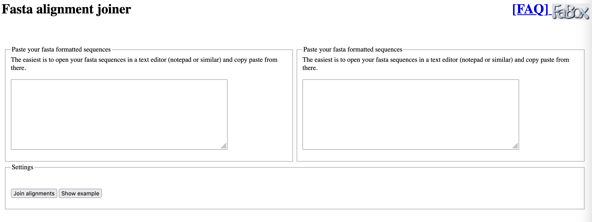
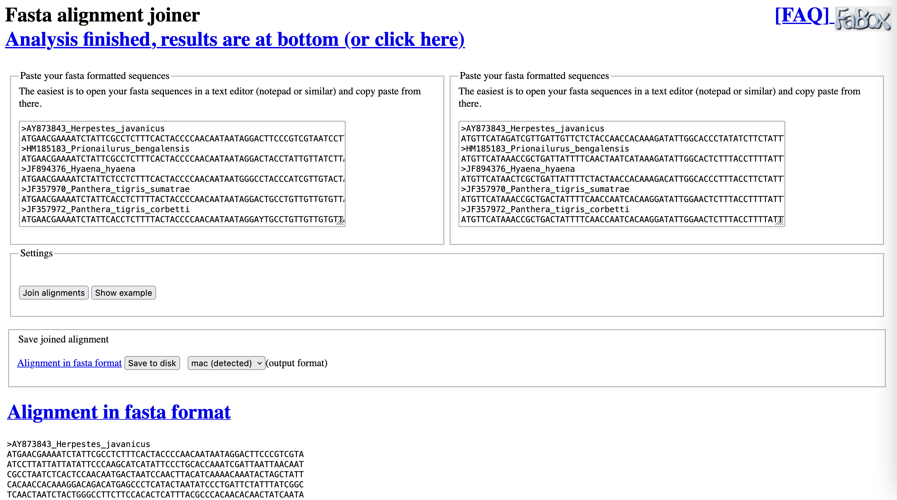

# **MULTIPLE SEQUENCE ALIGNMENT**


From the first tutorial you have learned how to download data from Genbank, how to modify your fasta format sequence files and how to convert them to other sequence file formats. Just remember that the sequences are not aligned! It means that they have different lengths and nucleotide positions are not *homologous*! Here we are going to align our datasets using one of the most used aligners:


**MAFFT:** This is a multiple sequence alignment program for unix-like operating systems. We will be using an online version of the program at the following link: [https://mafft.cbrc.jp/alignment/server/](https://mafft.cbrc.jp/alignment/server/). But the installation of the program should be easy on all operating systems and optionally you can install it on your personal computer from [here](https://mafft.cbrc.jp/alignment/software/). 

Open the link in a separate window. You should have something similar to this:

<p align="center"></p>

In the above picture, you see two red rectangles. the first one is where you click to upload your fasta format file and the second rectangle is where you can write your email to receive the aligned sequences. We will now align our whole mitochondrial genome sequences. Upload your `Felidae_MtGenomes.fasta` file and click on `Submit`! 

After some minutes you should see something similar to this now:

<p align="center"></p>

Here again there are two red rectangles. At the top of the page you can read `Fasta format`. We will click here in a few seconds, but before I wanted to show you something else. In the second red rectangle you can see the name of your sequences. Do you see something interesting in the format of the names? *They are all maximum 15 character long!* Also, you can see that the sequences are *interleaved*. The last line is a measure of how preserved a column is in your alignment.

Ok, let's click on Fasta format now. You will be asked to save a file. Save it as `Felidae_MtGenomes_aligned.fasta` and then open the file in a text editor, you should see something like this:

<p align="center"></p>

You thus have your mitochondrial genome sequences aligned in the fasta format, but they are not easy to look at in a text editor. 

Now open the `Felidae_MtGenomes_aligned.fasta` file in **Aliview**. *How does it look? Does it look more "aligned" than what you had before?* You should see something like this now:

<p align="center"></p>

*Is there anything in the alignment which catches your attention?* Scrolling along the alignment, it doesn't look very good in some parts, whereas other parts look quite nicely aligned. *Why might that be?* Does this look like an alignment you would be happy to analyse using phylogenetic methods? Maybe not. Remember, alignments are statements of homology for the positions of nucleotides in your sequences, and clearly we are unsure of homology in some positions (lots of gaps).

We would thus like to extract regions that appear to be more easy to align from our mitochondrial genome. Such regions are the protein coding genes, of which there are 13 in most animal mitochondria. For this tutorial, we will work with the four genes we downloaded in the previous tutorial: **ATP6, COI, CytB**, and **ND5**. To do that we will take advantage of a nice feature on the MAFFT webserver [https://mafft.cbrc.jp/alignment/server/specificregion-last.html](https://mafft.cbrc.jp/alignment/server/specificregion-last.html). Click on the link and you should see the following:

<p align="center"></p>

The first box is for a reference sequence of the region that you want to extract from your mitochondrial assembly. You can start with the file `ATP6.fasta`. The second box is for the unaligned fasta file of all the mitochondrial genomes `Felidae_MtGenomes.fasta`. Once you have chosen the relevant files, click on `Submit`.

Very quickly you should get back 54 sequences of **ATP6** from your mitochondrial genomes. As above, save this file as a *FASTA* file with the name `FelidaeATP6.fasta`. Now repeat this with the other three genes. You should now have 4 files:

```
FelidaeATP6.fasta
FelidaeCOI.fasta
FelidaeCytB.fasta
FelidaeND5.fasta
```

Check each of these alignments in **Aliview**. *How do the alignments look now? Would you be willing to analyse these data in a phylogenetic framework?* Visualizing an alignment like this is very complicated and a receipe for errors. Try to use the visualizing options you have in **Aliview**. For example if you click on the `Translate nucleotide sequence to Amino Acids`, which is the one marked with the red rectangle in the following picture, you should see this (make sure you have chosen the `2.vertebrate mitochondrial` code for the translation):

<p align="center"></p>

As you see, the majority of the changes in the nucleotide level do not change the corresponding amino acid. This is called a **Synonymous Mutation** as you have probably guessed. Scroll towards the end of the alignment of `FelidaeCOI.fasta`, at some point the number of non synonymous changes suddenly increases. *Can you find the reason? What do you see in the column `1347`?* It should be something like this:

<p align="center"></p>

There is a gap for all the sequences but one, which has an `n` in that position (right black rectangle). This gap column, changes the translation frame (reading frame). In a protein coding gene this is clearly not possible, therefore the `n`is wrong and most probably it is a sequencing error. Select the whole column, click on `Edit` and choose the `Delete selected` option. Pay extra attention to only delete this column and nothing else by error. Take a look at the other rectangle in the picture, there is a single gap in the middle of a protein coding gene. Here again a single gap is not possible. Replace it with an `n`. *Why is it not possible to have a single gap in this position? Why do we replace it with an `n`?* Save the **COI** file after modifying it.

Before we can proceed with concatenation, we still have to modify the headers of the sequences, so that each species has an identical header in each of the gene files. E.g. in the `FelidaeATP6.fasta` file, the headers look something like this:

```
>_pos=8662-9342_KP202271_Acinonyx_jubatus
```

This needs to be edited in a text editor to look like this:

```
>KP202271_Acinonyx_jubatus
```

And this needs to be done in each of the four sequence files. Note also that the first sequence in the fasta file is the reference sequence. This should be deleted. Once this is done, we are ready for concatenation.


## Concatenation

Concatenation of sequences means adding sequences from the same organism but from different genes one after another in order to create a larger dataset for the analysis as opposed to analysing single-gene datasets. There are many programs available for concatenation of sequences. You can even concatenate your sequences with a text editor or using a few commands in any programming language if you feel confortable with it. Here we are going to use an online application.

[FaBox (1.5) - an online fasta sequence toolbox](http://users-birc.au.dk/palle/php/fabox/index.php) is a useful online tool for simple tasks using fasta files. The webpage is developed by Aarhus University. Open the link in a new page. You should see something like this:

<p align="center"></p>

Please click on the only option which is red (*Fasta alignment joiner*). You should see this now:

<p align="center"></p>

Open the `FelidaeATP6.fasta` file in a text editor and copy-paste it to the left panel and your `FelidaeCOI.fasta` file on the right. Click on `Join alignments`. You should have something like this now:

<p align="center"></p>

Now click on *`Save to disk`* and save the `alignment.fasta` file on your computer. Rename this file to `ATP6_COI.fasta`. Remember that you can also just copy/paste the alignment directly from your browser and save it in your text editor. Now repeat the concatenation procedure by choosing the `ATP6_COI.fasta` file on the left and the `FelidaeCytB.fasta` on the right, and repeat until you create a file called `ATP6_COI_CytB_ND5.fasta`. Pay attention to the order of the genes!

Open Aliview and open the file you just created in it. Take a look at it to see if it seems good to you. Now save it as a Phylip file by going to `File` and clicking on `Save as Phylip (full names & padded)`. Give the name `ATP6_COI_CytB_ND5.phy`

So now we have an alignment of 4 concatenated genes in a single alignment file. But what we don't see immediately in this "*Super Gene*" alignment is where each gene starts and ends in the alignment. One way to obtain this information is to open each gene's alignment `FelidaeATP6.fasta`, `FelidaeCOI.fasta`, `FelidaeCytB.fasta` and `FelidaeND5.fasta` in *Aliview* and look at their lengths. In our concatenated matrix we know the order of the genes, so you can obtain the position of each gene easily. Create a file in your text editor called `Gene_partitions.txt` and write down the information of each gene as:

```
DNA, ATP6 = 1 - W
DNA, COI = W+1 - W+X
DNA, CYTB = W+X+1 - W+X+Y
DNA, ND5 = W+X+Y+1 - W+X+Y+Z

```

*What are the correct values for `W`, `X`, `Y`, and `Z`?* 

These are the lengths of the individual genes.

```
W = 681 (ATP6)
X = 1545 (COI)
Y = 1140 (CytB)
Z = 1821 (ND5)
```

Replace the correct values and save your file. Now we are ready to find out which partitioning scheme is best for our dataset in the next tutorial.


