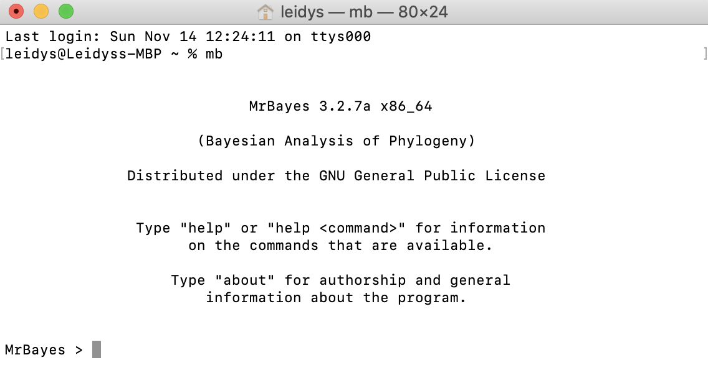
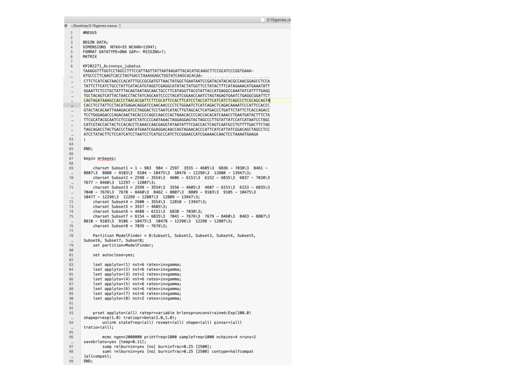
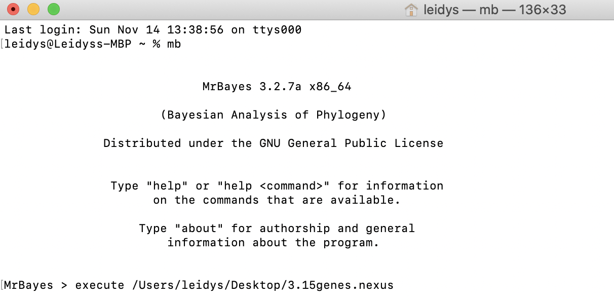
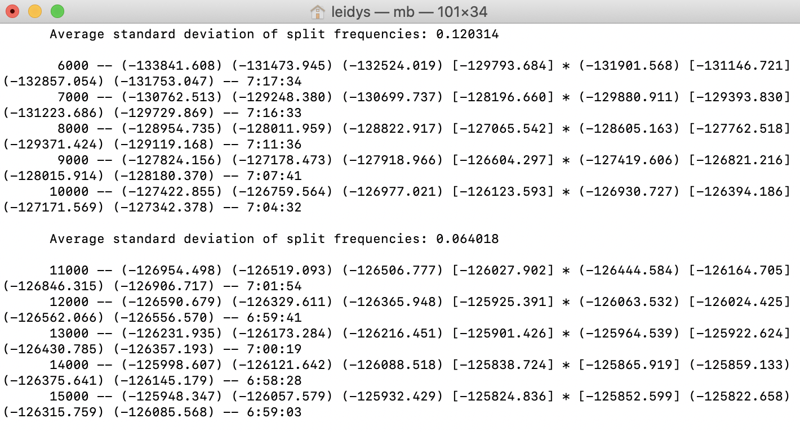
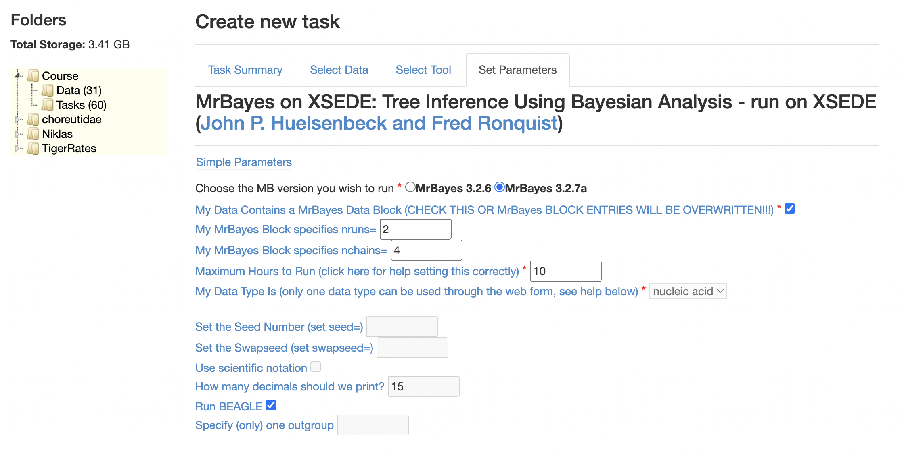
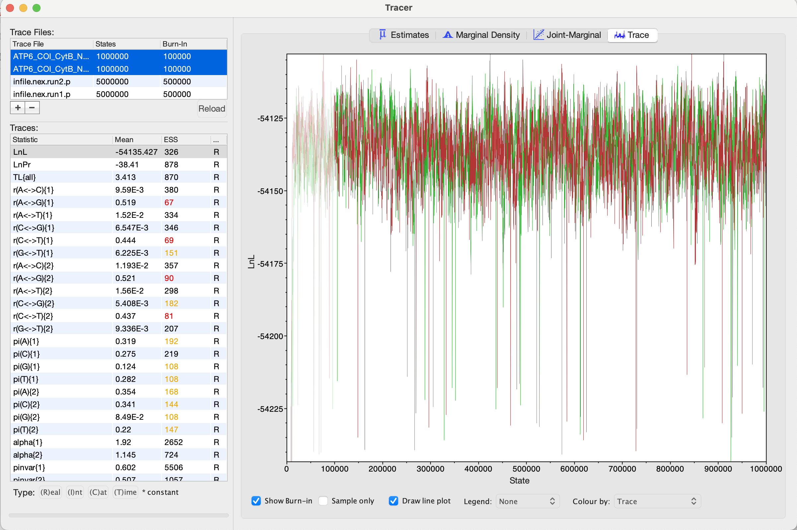
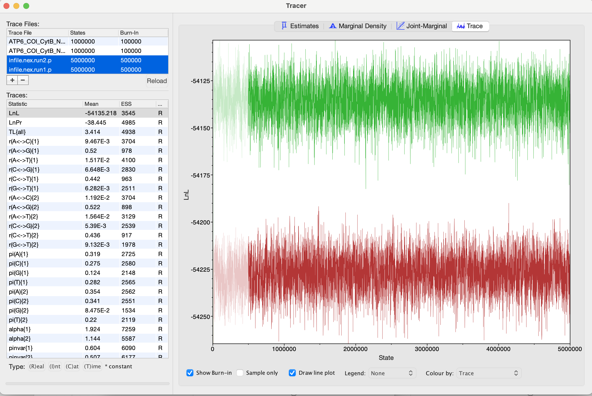
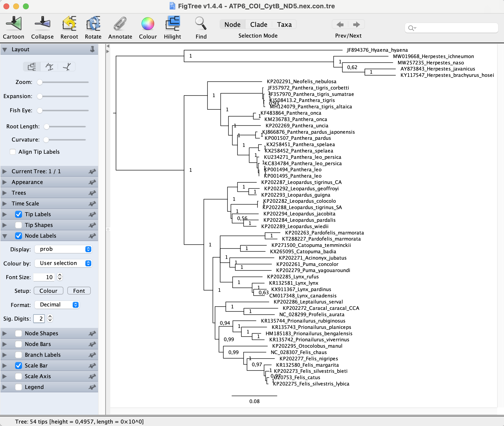

# Bayesian inference with MrBayes

Bayesian inference differs from Maximum Likelihood in several ways and one of the main ones is that it takes into account prior probabilities. In the context of phylogenetic inference, this means that the parameter space can be constrained towards values (from parameters in the nucelotide subtitution model to fossil priors or biogeographic evidence) that are considered realistic based on the findings from previous studies. These in turn then influence the posterior probability of your hyphothesis, which in the case of phylogenetic inference is the phylogeny with its topology, branch lengths, and all of the sequence evolution model parameters.

For this practical, we will work with MrBayes. MrBayes is a program that incorporates model choice across a wide range of phylogenetic and evolutionary models. MrBayes uses Markov chain Monte Carlo (MCMC) methods to estimate the posterior distribution of model parameters. MrBayes may be downloaded as a pre-compiled executable or in source form from [here](http://nbisweden.github.io/MrBayes/download.html). For more detailed instructions click [here](https://github.com/NBISweden/MrBayes/blob/develop/INSTALL).

This is a ”user unfriendly” program, i.e. it is command driven and opens up in the terminal window. To use it, you need to know the sequence of commands that need to be input into the program. First start the program with the command "mb" in the terminal.

<p align="center"></p>

The first thing is to prepare your dataset (which is in the NEXUS format). MrBayes analyses can be done either by command line step by step or by adding all the parameters and different data partitions to your data file. You can add this information in a text editor at the end of your data file. See the following example: 

<p align="center"></p>


Open your text editor to edit your `ATP6_COI_CytB_ND5.nex` file. First, we need to delete the blocks that AliView automatically adds at the end of your nexus alignment by default. Scroll to the end of your alignment file and you should see blocks that look like this:

```
BEGIN ASSUMPTIONS;
EXSET * UNTITLED  = ;
END;

BEGIN CODONS;
CODONPOSSET * CodonPositions =
 N:,
 1: 1-5188\3,
 2: 2-5186\3,
 3: 3-5187\3;
CODESET  * UNTITLED = Universal: all ;
END;

BEGIN SETS;
END;
```

After deleting the above blocks, simply paste this block instead:

```
begin mrbayes;
  charset ATP6_COI = 1 - 681  682 - 2226;
  charset CYTB_ND5 = 2227 - 3366  3367 - 5187;
  
  Partition ModelFinder = 2:ATP6_COI, CYTB_ND5 ;
  set partition=ModelFinder;

  set autoclose=yes;

  lset applyto=(1) nst=6 rates=invgamma;
  lset applyto=(2) nst=6 rates=invgamma;
  prset applyto=(all) ratepr=variable brlensp=unconstrained:Exp(100.0) shapepr=exp(1.0) tratiopr=beta(2.0,1.0);
  unlink statefreq=(all) revmat=(all) shape=(all) pinvar=(all) tratio=(all);
  mcmc ngen=20000 printfreq=100 samplefreq=100 nchains=4 nruns=2 savebrlens=yes [temp=0.11];
  sump relburnin=yes [no] burninfrac=0.25 [2500];
  sumt relburnin=yes [no] burninfrac=0.25 [2500] contype=halfcompat [allcompat];
end;

```

After you prepare the NEXUS file, save it as `ATP6_COI_CytB_ND5.nex`. Next, open a terminal, run MrBayes and finally run your analysis by writing ”execute" filename (provide the path of your file). 

<p align="center"></p>

If the dataset is okay, the analysis should look like this:

<p align="center"></p>

A Bayesian analysis is rather slow. In this example we are running 20 000 generations and that's not enough to get so-called convergence. We need to run the analysis for at least 1 000 000 generations and we will do this on a server. One such server is the [CIPRES portal](https://www.phylo.org/portal2/login!input.action). Create a user account. Then modify your nexus file for the MrBayes analysis so that ngen=1000000. You can leave everything else the same. Now you're ready to upload your file into the **Data** folder. Go to the **Tasks** folder and click on the `Create New Task` button. Write `Felidae` in the **Description** box, select `ATP6_COI_CytB_ND5.nex` in `Select Input Data`, under `Select Tool` choose **MrBayes on XSEDE (3.2.7a)  - Tree Inference Using Bayesian Analysis - run on XSEDE**, and finally for the **Input Parameters** select the following:

<p align="center"></p>

Once you have saved the parameters (and clicked on **OK** twice), you are ready to run your analysis on CIPRES, just click on `Save and Run Task`, and wait for an email to tell you it is ready! It'll take about an hour for the analysis to finish. In the meantime, we will go through Tutorial 5, [Maximum likelihood methods](../MaximumLikelihood/).

When the Bayesian analysis finishes, we will check for convergence. First, we are interested in the parameter estimates from the two concurrent runs from MrBayes. These are the files that end with the extension `*.p`. We are especially interested in whether the two independent runs reached the same log likelihood. Also, the goal is that for each parameter estimate we reach ESS values > 200 (ESS stands for effective sample size and is one of the measures of convergence in a Bayesian analysis). Upload the `*.p` files into Tracer. The easiest way of doing this is to drag the `*.p` files into the upper left corner of the Tracer window that's named Trace files. Then select both trace files and in the section in the upper right choose the Trace tab.

This is what it looks like when the two runs converge.

<p align="center"></p>

And this is what it looks like when they didn't converge.

<p align="center"></p>

Questions:

1. Did both runs reach the same log likelihood?
2. Check all of the parameter estimates. Did they all reach ESS > 200?
3. Which parameters were difficult to estimate (i.e., their ESS values are low)? Do you know why?

If your runs converged, you can have a look at the tree. The file that we want to examine has the extension `*.tre` and can be opened in FigTree. You should reroot the tree by clicking on the branch leading to hyaena and the other outgroups. Then in the menu on the left hand side choose the section **Trees** and order the nodes with the decreasing order. We also want to see the nodal support. In a Bayesian analysis this is going to be the so-called posteriror probability. On the left hand side go to the section **Node Labels** (you can also choose **Branch Labels** - you will get the same values placed closer to the center of the branches), place a checkmark next to it, and under the **Display** menu choose "prob". You can also change the font size for your tip and/or node labels.

Your tree should look similar to this one.

<p align="center"></p>

Questions:

1. Is the tree fully dichotomous or are there some clades that are unresolved?
2. Are there clades that didn't get statistically significant branch support? Do you remember what is considered significant for posterior probabilities?
3. For some species we had sequences from multiple individuals. Did they all come together in the tree?


**Optional**

As we mentioned before, another way to run the program is by giving the commands step by step. You only need your dataset and partition in the NEXUS format. To do so, follow these instructions: 

Write ”Execute filename” (obviously replacing ”filename” with the name of your data file). This assumes that the input file is in the same directory as the MrBayes executable. If you have different data partitions (e.g. different genes) in the data file, take care to define these character sets using the charset command. 

The next thing to do is to define the model you want to use to analyze your dataset: ”lset nst=6 rates=invgamma” gives you the GTR+I+G model (see the manual for the other kinds of models). 

Now it is time to run your first analysis. This is done with the command ”mcmc” with a string of options after it, eg `mcmc ngen=20000 printfreq=100 samplefreq=100 savebrlens=yes;`. This will run 20000 generations, sampling trees and parameters every 100 generations and printing to the screen every 100 generations (so that you can follow what is happening). Branch lengths of the trees are also saved (which makes bigger files). When 20000 generations have been done, the program will ask whether it should continue (unless you specify ”set autoclose=yes;” in the beginning, in which case the analysis terminates). Write in ”no” for the time being.

Once the analysis is done, you will notice several new files have appeared in your folder where the program and your dataset are. These include filename.mcmc, filename.run1.p, filename.run1.t, filename.run2.p and filename.run2.t. the \*.p files contain the sampled parameter values and log likelihoods, the \*.t files contain all sampled trees. 
	
Now you have to determine the burn-in, which means how many sampled generations from the beginning you need to discard. This can be done by giving the command ”sump”. **sump** command summarizes the parameter valuess in both the \*.p files, but importantly for now, it generates a graph showing the development of the log likelihood values over the sampled generations. Scroll upwards in the Command box if you do not see the graph. You can visually inspect the graph to see where equilibrium is reached and you can discard all generations before that. To double check, you can run the command again, this time with the number of sampled generations to be discarded, e.g. `sump burnin=20`. If the graph looks fine, then it is time to summarize the trees with the command `sumt burnin=20`. This generates 3 new files filename.con, filename.parts and filename.trprobs. For the time being the first file is the most important, it includes the 50%-majority rule tree for the dataset including branch lengths and posterior probabilities. Add the extension .tre to this file and open it in FigTree and click on the ”Phylogram” button to view the branch lengths, and the ”Internal labels” button to view the posterior probabilities.
	

