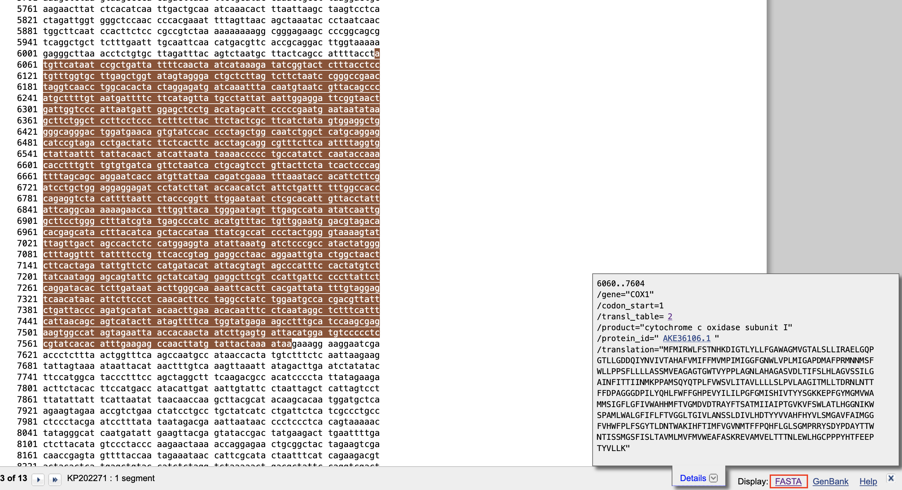

# **Dataset Manipulation**

## **Introduction**

In this section we will learn to download genetic sequence information from online databases (i.e. Genbank) and generate a dataset. Later on, by following tutorials, you will align this dataset file and convert it to different alignment file formats. We will also learn here how to convert between different formats used in phylogenetic programs and the main differences between these formats.

## **Download the data**

Using a web browser, you need to navigate to the NCBI’s Genbank. Even if the [link]( https://www.ncbi.nlm.nih.gov/genbank/) is not easy to remember, googling basically any keyword combination containing Genbank will bring you to the NCBI quite easily. In Genbank each sequence entry has a unique identification code called the ***accession number***. For this exercise, you need to download the sequences from several genes with the following accession numbers which correspond to mitochondrial genome entries.

| # | Accession Number | Organism name | English name |
|-----|-----|-----|-----|
| 1 | KP202271 | *Acinonyx jubatus* | Cheetah |
| 2 | KP202272 | *Caracal caracal* | Caracal |
| 3 | KX265095 | *Catopuma badia* | Bay Cat |
| 4 | KP271500 | *Catopuma temminckii* | Asiatic Golden Cat |
| 5 | U20753 | *Felis catus* | Domestic Cat |
| 6 | NC_028307 | *Felis chaus* | Jungle Cat |
| 7 | KR132580 | *Felis margarita* | Sand Cat |
| 8 | KP202277 | *Felis nigripes* | Black-footed Cat |
| 9 | KP202273 | *Felis silvestris bietis* | WildCat |
| 10 | KP202275 | *Felis silvestris lybica* | WildCat |
| 11 | KP202282 | *Leopardus colocolo* | Pampas Cat |
| 12 | KP202292 | *Leopardus geoffroyi* | Geoffroy’s Cat |
| 13 | KP202293 | *Leopardus guigna* | Kodkod |
| 14 | KP202294 | *Leopardus jacobita* | Andean Mountain Cat |
| 15 | KP202284 | *Leopardus pardalis* | Ocelot |
| 16 | KP202287 | *Leopardus tigrinus_CA* | Oncilla (Central America) |
| 17 | KP202288 | *Leopardus tigrinus_SA* | Oncilla (South America) |
| 18 | KP202289 | *Leopardus wiedii* | Margay |
| 19 | KP202286 | *Leptailurus serval* | Serval |
| 20 | CM017348 | *Lynx canadensis* | Canada Lynx |
| 21 | KR132581 | *Lynx lynx* | Eurasian Lynx |
| 22 | KX911367 | *Lynx pardinus* | Iberian Lynx |
| 23 | KP202285 | *Lynx rufus* | Bobcat |
| 24 | KP202291 | *Neofelis nebulosa* | Clouded Leopard |
| 25 | KP202295 | *Otocolobus manul* | Manul |
| 26 | KP001494 | *Panthera leo leo* | Lion |
| 27 | KP001495 | *Panthera leo leo* | Lion |
| 28 | KC834784 | *Panthera leo persica* | Asian Lion |
| 29 | KU234271 | *Panthera leo persica* | Asian Lion |
| 30 | KX258451 | *Panthera leo spelaea* | Cave Lion |
| 31 | KX258452 | *Panthera leo spelaea* | Cave Lion |
| 32 | KF483864 | *Panthera onca* | Jaguar |
| 33 | KM236783 | *Panthera onca* | Jaguar |
| 34 | KP001507 | *Panthera pardus pardus* | Leopard |
| 35 | KJ866876 | *Panthera pardus japonensis* | Leopard |
| 36 | KJ508413 | *Panthera tigris tigris* | Tiger |
| 37 | MH124079 | *Panthera tigris altaica* | Tiger |
| 38 | JF357972 | *Panthera tigris corbetti* | Tiger |
| 39 | JF357970 | *Panthera tigris sumatrae* | Tiger |
| 40 | KP202269 | *Panthera uncia* | Snow Leopard |
| 41 | KP202263 | *Pardofelis marmorata* | Marbled Cat |
| 42 | KT288227 | *Pardofelis marmorata* | Marbled Cat |
| 43 | HM185183 | *Prionailurus bengalensisa* | Leopard Cat |
| 44 | KR135743 | *Prionailurus planiceps* | Flat-headed Cat |
| 45 | KR135744 | *Prionailurus rubiginosus* | Rusty-spotted Cat |
| 46 | KR135742 | *Prionailurus viverrinus* | Fishing Cat |
| 47 | NC_028299 | *Profelis aurata* | African Golden Cat |
| 48 | KP202261 | *Puma concolor* | Puma |
| 49 | KP202279 | *Puma yagouaroundi* | Jaguarundi |
|  | OUTGROUPS |  | 
| 50 | KY117547 | *Herpestes brachyurus hosei* | Short-tailed Mongoose |
| 51 | MW019668 | *Herpestes ichneumon* | Egyptian Mongoose |
| 52 | MW257235 | *Herpestes naso* | Long-nosed Mongoose |
| 53 | AY873843 | *Urva javanica* | Small Asian Mongoose |
| 54 | JF894376 | *Hyaena hyaena* | Striped Hyena |

Pictures of the species used to generate the sequences above.
<p align="center"></p>


Opening the [link]( https://www.ncbi.nlm.nih.gov/genbank/) provided earlier you can see the following (slight differences may exist due to different web browsers and operating systems and the position of the planets and …).


<p align="center"></p>


In the red rectangle you see a list option which should be on ***Nucleotide***. Clicking on the list you can see other repositories offered by the NCBI website. Here we are going to create a dataset of nucleotide sequences of protein-coding genes, so we choose the ***Nucleotide*** option. Remember that these markers being protein-coding genes allows us to also create ***Amino Acid*** datasets. *Do you know why we stay with nucleotides in this case? Which option allows you to create an amino acid dataset?*

Now pick an accession number from the list and hit search. If you like cheetahs (and you choose the first accession number in the list) you should see something similar to this picture:

<p align="center"></p>

Take a look at it. Try to decipher different parts of it. As you can see, first you read the accession number, the length of the sequence and some information about the entry. In the following lines there is more information about the organism, the authors of the sequence, if it is published in any scientific publication, their authors and so on. In this case in the comments you can even see some information on how this genome has been sequenced (Illumina) and how it has been assembled (SOAPdenovo). After this, you can find the information on the annotation of the sequence. Here is where you look to find a gene of interest for example.

Now look at the two red rectangles on top of the picture. The one on the left where you can read ***GenBank*** is the format of the information. And the other rectangle "***Send to:***" creates a downloadable file. Click on it. Choose ***Complete Record***, ***File*** under *Choose Destination* and finally in *format:* choose ***FASTA***. 

<p align="center"></p>

Now ***Create File***! And *Voila!* Congratulations! Now you have downloaded your first Fasta file. This fasta file is the sequence information of the whole mitochondrial genome of our nice cheetah sample (in the case you chose the first accession number). In principle, you could now do this for each mitochondrial genome separately, but that would be rather inefficient, as we have 54 mitochondrial genomes to download. Instead we can use the tool [Batch Entrez](https://www.ncbi.nlm.nih.gov/sites/batchentrez) to download a fasta file containing all the mitochondrial genomes we are interested in based on their accession numbers.

To use Batch Entrez, you need a simple text file containing all the accession numbers of the sequences you are interested in, in our case the mitochondrial genomes of the cats.  Copy the accession numbers in the table above into a text editor and make a file with only the accession numbers, with each accession number on its own line, i.e. all the other data should be removed. Save this file on your computer with the name

```
GB_accessions.txt
```
Then go to [Batch Entrez](https://www.ncbi.nlm.nih.gov/sites/batchentrez), where you will see the following screen:

<p align="center"></p>

The red rectangle shows you where you can first choose the database you want to retrieve the sequences from (in our case the default **Nucleotide** is good), and then upload the file with the accession numbers for the sequences by clicking on `Browse...`. Do so and click on `Retrieve`. Now you will see information about how successful your query was (hopefully all 54 sequences were found!), and there is a link *Retrieve records for 54 UID(s)*. Clicking on that link brings you to a list of the sequences that looks like this:

<p align="center"></p>

As with the single sequence, you can download all of the sequences from the **Send to:** menu (in the red rectangle). By default all the sequences in your search will be downloaded, if you do not tick any of them. Or you can choose which ones to download by ticking the boxes above the numbers. In this case we want all of them. Choose the ***FASTA*** format and save the file as 

```
Felidae_MtGenomes.fasta
```

You will align these sequences in the next tutorial. But before you do, you will download sequences of four genes that are found in the mitochondrial genome: ***COI, ATP6, CytB,*** and ***ND5***. You need each of these genes from only one species, as you will use them as reference sequences in Tutorial 2.

To do so, go to one of the mitochondrial genomes as you did at the beginning of this tutorial, e.g. the cheetah. Scroll down on the page to find the ***COI*** gene. Remember that some genes could have different names. It should look like this:

<p align="center"></p>

As you can see in the red rectangle, the gene is marked as ***COX1*** and its position on the sequence is given (6060-7604). In the **CDS** section, which stands for **Coding Sequences**, you will see extra information about the gene. Try to decipher different parts of it. *Is there anything you don't understand? Ask! Why don't the tRNAs before and after have a **CDS** section?*

Now we need to download the ***COI*** (or ***COX1***) gene from the mitochondrial whole genome entry. For this click on ***gene*** or ***CDS***. It should bring you to the end of the document and highlight the corresponding sequence in the whole genome sequence. You should see this:

<p align="center"></p>

Then you should click on the "**FASTA**" (marked in the red rectangle in the picture above). If you do so, you will see the fasta file of the marker we are interested in. You should see the following now:

<p align="center"></p>

This is the sequence we are interested in. *Do you remember how to download the sequence?* you have a reminder in the next picture...

<p align="center"></p>

Save this file as:

```
COI.fasta
```

Now repeat this for the other three genes (***ATP6, CytB,*** and ***ND5***), saving each gene into a file of its own in a similar manner as you did for the ***COI*** gene. You should thus have the following files:

```
COI.fasta
ATP6.fasta
CytB.fasta
ND5.fasta
```

---------

Now let's take a look at the *FASTA* file we have created. Open the file `Felidae_MtGenomes.fasta` in your (prefered) text editor. 

As you can see, each entry is something similar to this:

```
>KP202271.1:6060-7604 Acinonyx jubatus isolate AJU mitochondrion, complete genome
ATGTTCATAATCCGCTGATTATTTTCAACTAATCATAAAGATATCGGTACTCTTTACCTCCTGTTTGGTG
CTTGAGCTGGTATAGTAGGGACTGCTCTTAGTCTTCTAATCCGGGCCGAACTAGGTCAACCTGGCACACT
ACTAGGAGATGATCAAATTTACAATGTAATCGTTACAGCCCATGCTTTTGTAATGATTTTCTTCATAGTT
ATGCCTATTATAATTGGAGGATTCGGTAACTGATTGGTCCCATTAATGATTGGAGCTCCTGACATAGCAT
TCCCCCGAATGAATAATATAAGCTTCTGGCTCCTTCCTCCCTCTTTCTTACTTCTACTCGCTTCATCTAT
AGTGGAGGCTGGGGCAGGGACTGGATGAACAGTGTATCCACCCCTAGCTGGCAATCTGGCTCATGCAGGA
GCATCCGTAGACCTGACTATCTTCTCACTTCACCTAGCAGGCGTTTCTTCAATTTTAGGTGCTATTAATT
TTATTACAACTATCATTAATATAAAACCCCCTGCCATATCTCAATACCAAACACCTTTGTTTGTGTGATC
AGTTCTAATCACTGCAGTCCTGTTACTTCTATCACTCCCAGTTTTAGCAGCAGGAATCACCATGTTATTA
ACAGATCGAAATTTAAATACCACATTCTTCGATCCTGCTGGAGGAGGAGATCCTATCTTATACCAACATC
TATTCTGATTTTTTGGCCACCCAGAGGTCTACATTTTAATTCTACCCGGTTTTGGAATAATCTCGCACAT
TGTTACCTATTATTCAGGCAAAAAAGAACCATTTGGTTACATGGGAATAGTTTGAGCCATAATATCAATT
GGCTTCCTGGGCTTTATCGTATGAGCCCATCACATGTTTACTGTTGGAATGGACGTAGACACACGAGCAT
ACTTTACATCAGCTACCATAATTATCGCCATCCCTACTGGGGTAAAAGTATTTAGTTGACTAGCCACTCT
CCATGGAGGTAATATTAAATGATCTCCCGCCATACTATGGGCTTTAGGTTTTATTTTCCTGTTCACCGTA
GGAGGCCTAACAGGAATTGTACTGGCTAACTCTTCACTAGATATTGTTCTCCATGATACATATTACGTAG
TAGCCCATTTCCACTATGTCTTATCAATAGGAGCAGTATTCGCTATCATAGGAGGCTTCGTCCATTGATT
CCCCTTATTCTCAGGATACACTCTTGATAATACTTGGGCAAAAATTCACTTCACGATTATATTTGTAGGA
GTCAACATAACATTCTTCCCTCAACACTTCCTAGGCCTATCTGGAATGCCACGACGTTATTCTGATTACC
CAGATGCATATACAACTTGAAACACAATTTCCTCAATAGGCTCTTTCATTTCATTAACAGCAGTCATACT
TATAGTTTTCATGGTATGAGAAGCCTTTGCATCCAAGCGAGAAGTGGCCATAGTAGAATTAACCACAACT
AATCTTGAGTGATTACATGGATGTCCCCCTCCGTATCACACATTTGAAGAGCCAACTTATGTATTACTAA
AATAA
```

The line starting with `>` in a fasta file is a header for the sequence. Practically all programs will have problems with how Genbank has created these fasta files. So in your text editor go and modify the name of each sequence to keep only the accesion number and organism name. Remember that an empty space is not allowed in the name! Replace it with an underscore `_`. You should have exactly the same header as below now. Pay attention to this step, as it is really important to have the exact same header for each sequence because this needs to be the exact same for every gene. Remember to save your file when you are done. 


```
>KP202271_Acinonyx_jubatus
ATGTTCATAATCCGCTGATTATTTTCAACTAATCATAAAGATATCGGTACTCTTTACCTCCTGTTTGGTG
CTTGAGCTGGTATAGTAGGGACTGCTCTTAGTCTTCTAATCCGGGCCGAACTAGGTCAACCTGGCACACT
ACTAGGAGATGATCAAATTTACAATGTAATCGTTACAGCCCATGCTTTTGTAATGATTTTCTTCATAGTT
ATGCCTATTATAATTGGAGGATTCGGTAACTGATTGGTCCCATTAATGATTGGAGCTCCTGACATAGCAT
TCCCCCGAATGAATAATATAAGCTTCTGGCTCCTTCCTCCCTCTTTCTTACTTCTACTCGCTTCATCTAT
AGTGGAGGCTGGGGCAGGGACTGGATGAACAGTGTATCCACCCCTAGCTGGCAATCTGGCTCATGCAGGA
GCATCCGTAGACCTGACTATCTTCTCACTTCACCTAGCAGGCGTTTCTTCAATTTTAGGTGCTATTAATT
TTATTACAACTATCATTAATATAAAACCCCCTGCCATATCTCAATACCAAACACCTTTGTTTGTGTGATC
AGTTCTAATCACTGCAGTCCTGTTACTTCTATCACTCCCAGTTTTAGCAGCAGGAATCACCATGTTATTA
ACAGATCGAAATTTAAATACCACATTCTTCGATCCTGCTGGAGGAGGAGATCCTATCTTATACCAACATC
TATTCTGATTTTTTGGCCACCCAGAGGTCTACATTTTAATTCTACCCGGTTTTGGAATAATCTCGCACAT
TGTTACCTATTATTCAGGCAAAAAAGAACCATTTGGTTACATGGGAATAGTTTGAGCCATAATATCAATT
GGCTTCCTGGGCTTTATCGTATGAGCCCATCACATGTTTACTGTTGGAATGGACGTAGACACACGAGCAT
ACTTTACATCAGCTACCATAATTATCGCCATCCCTACTGGGGTAAAAGTATTTAGTTGACTAGCCACTCT
CCATGGAGGTAATATTAAATGATCTCCCGCCATACTATGGGCTTTAGGTTTTATTTTCCTGTTCACCGTA
GGAGGCCTAACAGGAATTGTACTGGCTAACTCTTCACTAGATATTGTTCTCCATGATACATATTACGTAG
TAGCCCATTTCCACTATGTCTTATCAATAGGAGCAGTATTCGCTATCATAGGAGGCTTCGTCCATTGATT
CCCCTTATTCTCAGGATACACTCTTGATAATACTTGGGCAAAAATTCACTTCACGATTATATTTGTAGGA
GTCAACATAACATTCTTCCCTCAACACTTCCTAGGCCTATCTGGAATGCCACGACGTTATTCTGATTACC
CAGATGCATATACAACTTGAAACACAATTTCCTCAATAGGCTCTTTCATTTCATTAACAGCAGTCATACT
TATAGTTTTCATGGTATGAGAAGCCTTTGCATCCAAGCGAGAAGTGGCCATAGTAGAATTAACCACAACT
AATCTTGAGTGATTACATGGATGTCCCCCTCCGTATCACACATTTGAAGAGCCAACTTATGTATTACTAA
AATAA

```

Now we can proceed to the next tutorial to learn about Alignment Methods. But first let's take a look at our sequence files in a graphical interface specifically designed to visualize sequences and alignments, ***Aliview***.

Open the program, click on `File`, `Open File` and find the fasta files you have created, `Felidae_MtGenomes.fasta`. You should see something like this.

<p align="center"></p>

Before moving on, consider what this file looks like. Very few sites look  ***aligned***, right? This is a quite small dataset of relatively conserved sequences, so you can easily find patterns within the file and you should be able to align it by hand given enough time with no major problems. We will check our alignment once we obtain it in this program again.

Now if you click again on `File` you will see something like this:

<p align="center"></p>

As you can see, this program allows us to convert/save a sequence file in many different formats which can be used in different programs. Remember this for when we are going to convert the alignment to other file formats than fasta.
