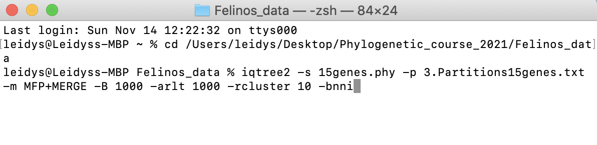
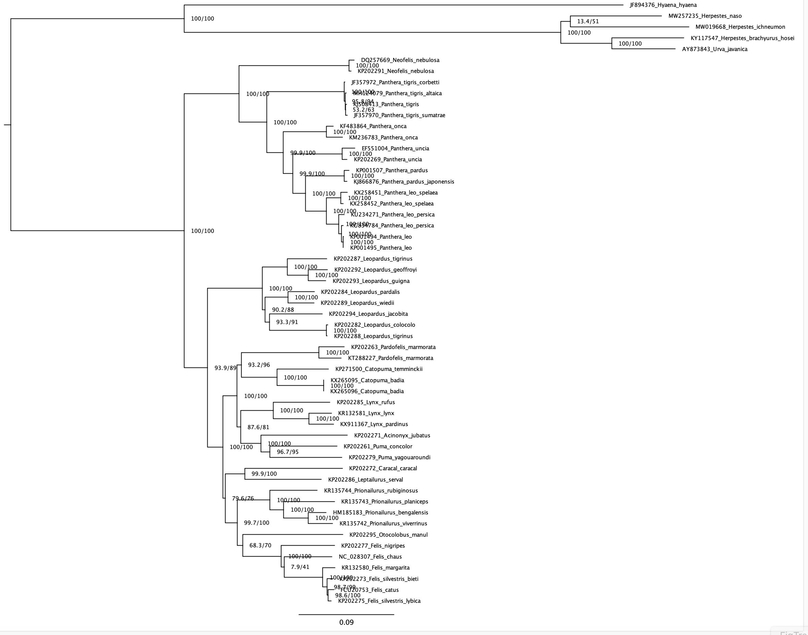

# Maximum-Likelihood Phylogenetic Inference


## **IQTREE** 
Now that we learned how to use IQ-TREE for model and partition search, we will move on to doing phylogenetic inference with it.

**Command line instructions and Tree inference**

Tree Inference is one of the most frequently used features of IQ-TREE and allows users to carry out phylogenetic analysis on a multiple sequence alignment (MSA). In the most basic case, no more than an MSA file is required to submit the job. Without further input, IQ-TREE will run with the default parameters and auto-detect the sequence type as well as the best-fitting substitution model. Additionally, Ultrafast Bootstrap ([Hoang et al., 2018](https://academic.oup.com/mbe/article/35/2/518/4565479)) and the SH-aLRT branch test ([Guindon et al., 2010](https://academic.oup.com/sysbio/article/59/3/307/1702850)) will be performed.


Go into the iqtree folder in your terminal as you did for the [previous tutorial](../ModelSelection/Readme.md#Running-ModelFinder-with-IQ-TREE)


**Command reference**

`iqtree`: will call the executable

`-s <Alignment-file.phy>`: this option points your alignment to the program.

`-p <Partition-file>`: is your partition file, each partition to have its own evolution rate.

`-m MFP+MERGE`: like the option `MF+MERGE` that we used last time, but actually does phylogenetic inference with the found best models for the best partitioning scheme.

`-B`: will perfom Ultrafast Boostrap.

`-alrt`: will perform the SH-aLRT test.

`-bnni`: reduce the risk of overestimating branch supports with UFBoot due to severe model violation.


1. Now you can try to run a simple analysis by entering


```
iqtree -s ATP6_COI_CytB_ND5.phy
```


In this case, IQTREE will infer a tree from a sequence alignment (file.phy) with the best-fit model automatically selected by ModelFinder.


2. However, to find best partition scheme by possibly merging partitions, followed by tree inference and branch support run an analysis by entering

```
iqtree -s ATP6_COI_CytB_ND5.phy -p Gene_partitions.txt -m MFP+MERGE -B 1000 -alrt 1000 --prefix tree_inference -bnni
```


You should have something similar to this:

<p align="center"></p>

**Congratulations! now that you have run the analyses, compare the results.**


**Output Files to check**

   Suffix	     
   
- `.iqtree`	     Full result of the run, this is the main report file.

- `.log`	       Run log.

- `.treefile`	   Maximum likelihood tree in NEWICK format, can be visualized with treeviewer programs.

- `.ufboot`      Bootstrap trees.

- `.best_scheme.nex` best partitioning scheme.


# Tree visualization


Open the file `.treefile` retrieved from IQTREE and check the support values. You can open such a file in FigTree. The phylogeny should look more or less as shown in the next screenshot.

<p align="center"></p>

The tree is rooted by default on the first taxon in your dataset or on the longest branch in the dataset. In our case we should reroot the tree on the branch leading to *Hyaena and mongooses* (which is our outgroup). In FigTree, click on the branch leading to *Hyaena and mongooses* to select it, and then click on the "Reroot" button in FigTree.


**Questions**

1. *Are the UFBoot2 values higher/lower compared to those recovered from the SH-like in IQTREE?*

2. *How are the nodes/relationships supported?*

3. *Take a look at the best partitioning scheme. What are the merged partitions? Can you see any similarity pattern beween the merged partitions?*


----------

**Tree inference on Website (optional if you have not downloaded IQTREE)**

You can also to try out the IQ-TREE [web server](http:iqtree.cibiv.univie.ac.at/), where you only need to upload an alignment, choose the options and start the analysis.You can either try out the web server with an example alignment by ticking the corresponding box or upload your own alignment file. By clicking on ‘Browse’ a dialog will open where you can select your MSA; the file formats Phylip, Fasta, Nexus, Clustal and MSF are supported.

<p align="center"></p>

After that you can submit the job. If you provide an email address, a notification will be sent to you once the job is finished. In case you don’t specify an email address, you will receive a link in the next step; you can bookmark this link to retrieve your results after the job is finished.


**Model Selection on Website (optional if you have not downloaded IQTREE)**

IQ-TREE supports a wide range of substitution models for DNA, protein, codon, binary and morphological alignments. In case you do not know which model is appropriate for your data, IQ-TREE can automatically determine the best-fit model for your alignment. Use the Model Selection tab if you only want to find the best-fit model without doing tree reconstruction.

<p align="center"></p>

Like with Tree Inference, the only obligatory input is a multiple sequence alignment. You can either upload your own alignment file or use the example alignment to try out the web server and then submit the job.


**Analysis of Results from webserver**

In the tab Analysis Results you can monitor your jobs. With our example file, a run will only take a few seconds. The results will depend on the server load. For your own alignments the CPU time limit is 24 hours. If you provided an email address when submitting the job, you will get an email once it is finished.

<p align="center"></p>

Once a job is finished, you can select it by checking the corresponding box and then downloading the selected jobs as a zip file. This zip file will contain the results of your run, including the Run Log and the Full Result which are also accessible in the webserver.

   Suffix	     Output File Explanation
   
- `.iqtree`	     Full result of the run, this is the main report file.

- `.log`	       Run log.

- `.treefile`	   Maximum likelihood tree in NEWICK format, can be visualized with treeviewer programs.

- `.svg`	       Graphical tree representation in SVG format, done with ete view.

- `.pdf`	       Graphical tree representation in PDF format, done with ete view.

- `.contree`	   Consensus tree with assigned branch supports where branch lengths are optimized on the original alignment; printed if Ultrafast Bootstrap is selected.

- `.ckp.gz`	    Checkpoint file; included if a job was stopped because of RAM/CPU limits.

This tutorial was retrieved from the [IQTREE Web-Server](http://www.iqtree.org/doc/Web-Server-Tutorial)


