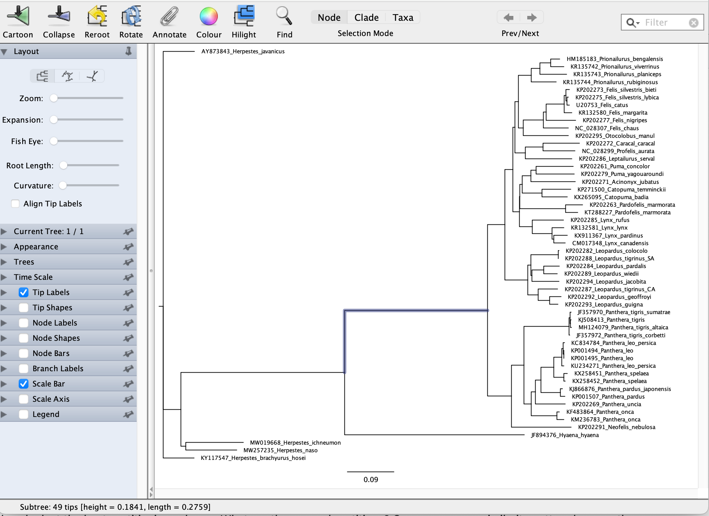
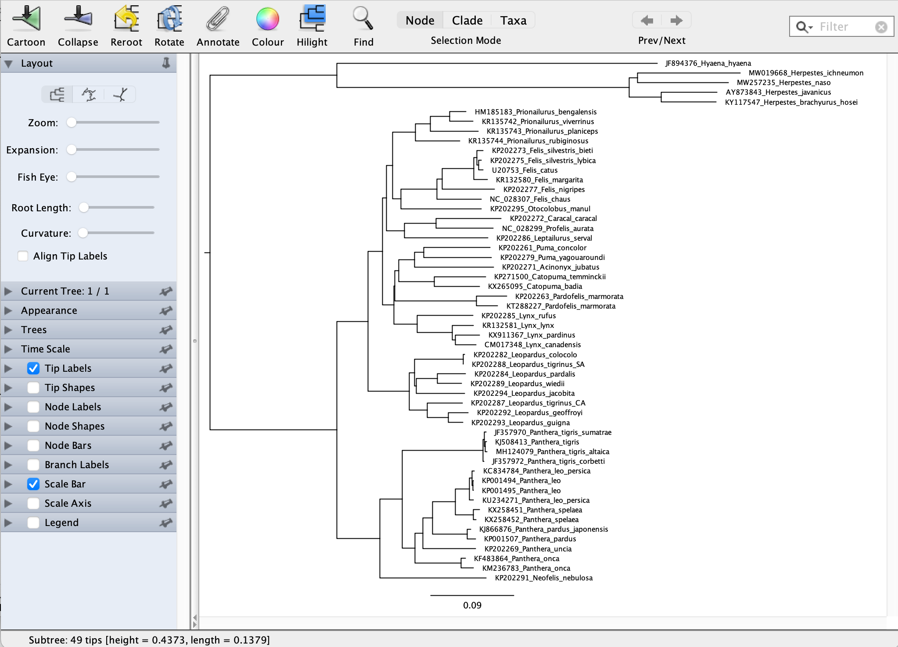
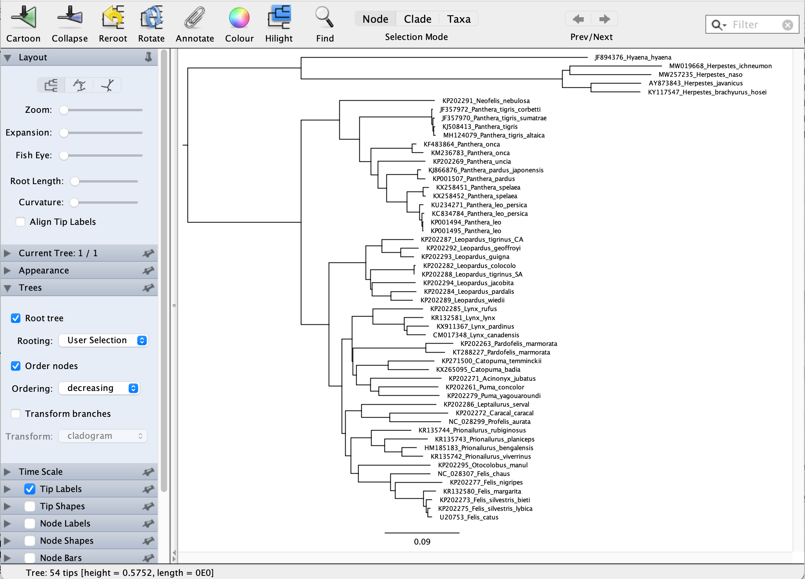
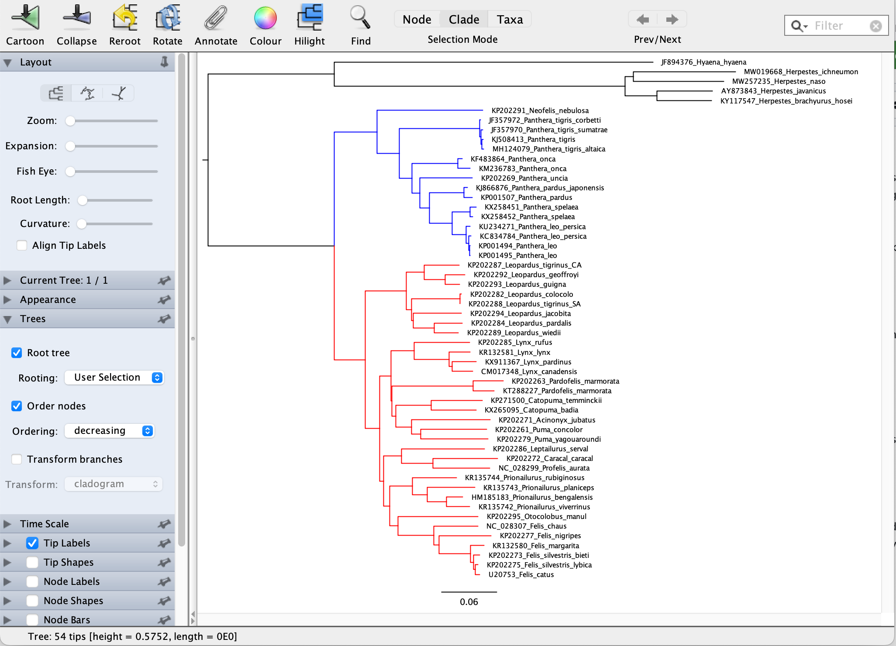
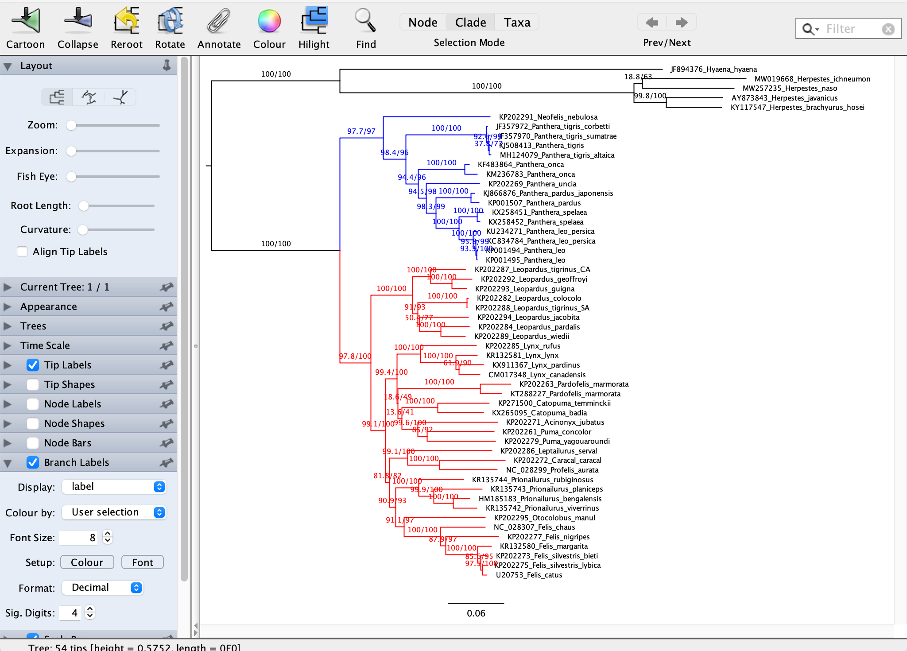
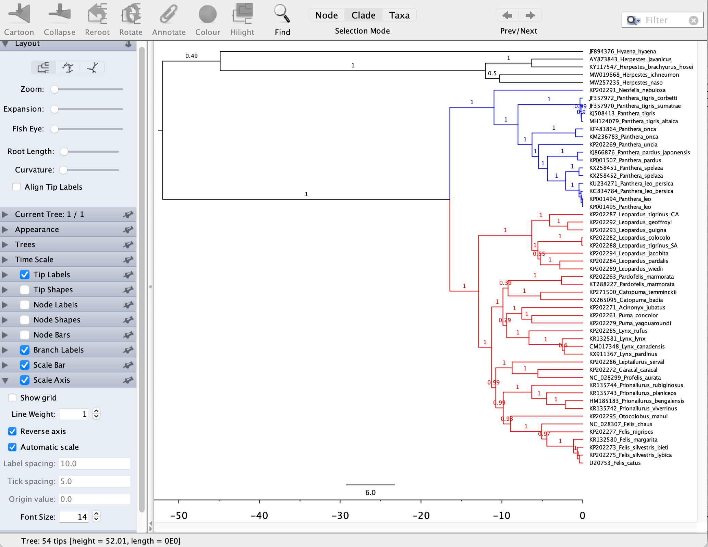

# Tree Manipulation

Once trees are generated, they can be used for a variety of purposes, from further analyses on the evolution of characters and other features, to making nice figures for publications. In this tutorial we will learn how to make a tree look nice for a publication or presentation, and think about the format of a tree file for other programs to read in for further analyses.

We will use **FigTree** for manipulating tree files. You have already used the program to look at your results from various analyses. Here we will start with the Maximum Likelihood tree from your IQTREE analysis (*.treefile). When you open the tree file in **FigTree**, it will look like this:

As you know, the root is placed on the first taxon in your dataset, so the tree needs to be rerooted on the branch which is highlighted above. Click on the branch and hit the ***Reroot*** button on the top, and the tree will now look like this:

Now the tree is technically correct, but perhaps aesthetically not so nice, the branches in Felidae appear rather jumbled. One way to make the tree appear neater is to *ladderize* it. Click on the `Trees` tab on the left and choose *Order nodes*. Ordering can be `increasing` or `decreasing`, choose the one which looks nicest to you! Here it is with `decreasing` chosen:

Perhaps we want to highlight some clades for our publication. We can do this by colouring the branches. Choose ***Clade*** in the ***Selection Mode*** button on the top, and then click on the root of the clade of interest. When the clade is highlighted, click on the ***Colour*** button on the top, and choose a colour for the clade. Do the same for as many clades as you want. Here is an example where two main clades are coloured:

Most likely we would like to report bootstrap and other support values on our tree for a figure in a publication. To make them visible, click on the `Branch Labels` tab on the left, and then *Display:* `label`:

There are various other things you can do in **FigTree**, e.g. make the branches thicker, change the tree style, change the place of the tip labels, expand the tree, increase/decrease font sizes, etc. Play around a bit with the options. To further spice up your figure, e.g. to add pictures of the taxa in the tree, you can export the tree as a pdf file and import it into a graphics program like Adobe Illustrator, InkScape or even PowerPoint.

## Time trees

There are some extra options for time trees. Open your BEAST2 tree in **FigTree**. You can do the same things as above, e.g. colour the clades, etc. In addition, you can add a time scale to the bottom of the tree. Go to the `Scale Axis` tab on the left, tick it and choose the option *Reverse axis* as well. Your tree should look like this:

Again, to further spice up the tree, e.g. putting in geological periods, export the tree as a pdf and open in a graphics program of your choice.
